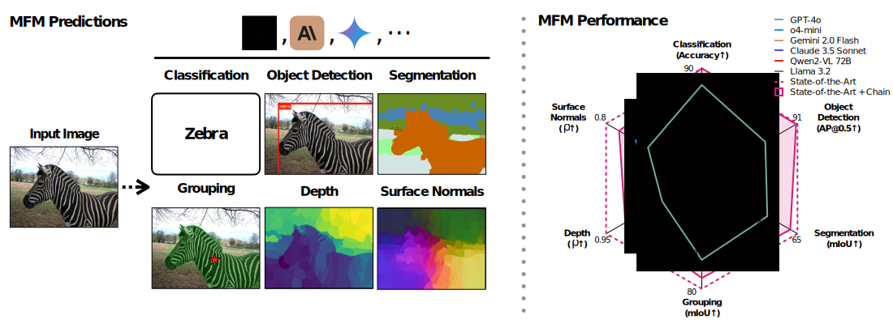
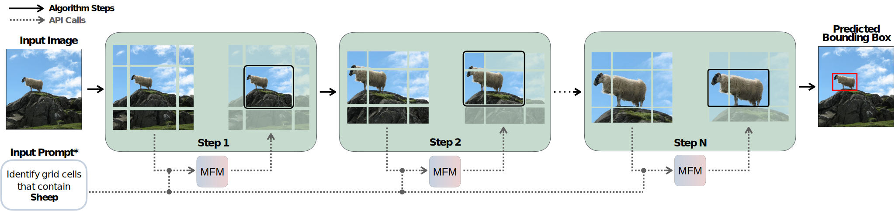
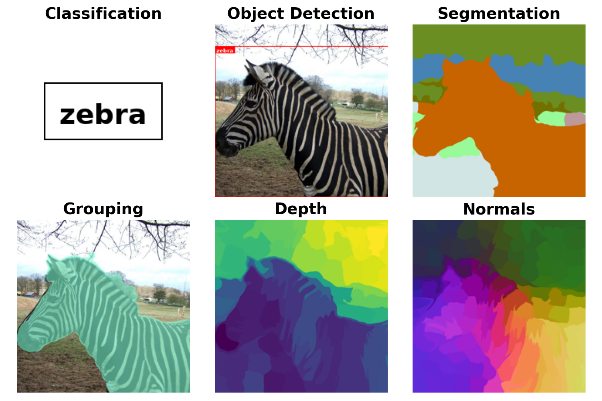

# How Well Does GPT-4o Understand Vision? Evaluating Multimodal Foundation Models on Standard Computer Vision Tasks

*A prompt-chaining framework to benchmark the capabilities of multimodal foundation models on several standard computer vision tasks.*

[`Website`](https://fm-vision-evals.epfl.ch/) | [`BibTeX`](#citation) 

Official implementation for :

[**How Well Does GPT-4o Understand Vision? Evaluating Multimodal Foundation Models on Standard Computer Vision Tasks**](https://fm-vision-evals.epfl.ch/) <br>
*[Rahul Ramachandran](https://rahuboy.github.io/), [Ali Garjani](https://garjania.github.io/), [Roman Bachmann](https://roman-bachmann.github.io/), [Andrei Atanov](https://andrewatanov.github.io/)\*, [Oğuzhan Fatih Kar](https://ofkar.github.io/)\*, [Amir Zamir](https://vilab.epfl.ch/zamir/)\**

<br>



## Abstract

Multimodal foundation models, such as GPT-4o, have recently made remarkable progress. However, it is not clear exactly where these models stand in terms of understanding vision. In this paper, we benchmark the performance of popular multimodal foundation models (GPT-4o, o4-mini, Gemini 1.5 Pro and Gemini 2.0 Flash, Claude 3.5 Sonnet, Qwen2-VL, Llama 3.2) on standard computer vision tasks (semantic segmentation, object detection, image classification, depth and surface normal prediction) and using established datasets (e.g., COCO, ImageNet and its variants, etc.).

The main challenges to performing this are:
1) Most models are trained to output text and cannot natively express versatile domains, such as segments or 3D geometry, and
2) Many leading models are proprietary and accessible only at an API level, i.e., there is no weight access to adapt them.

We address these challenges by translating standard vision tasks into equivalent text-promptable and API-compatible tasks via prompt chaining to create a standardized benchmarking framework. 

We observe that:
1) The models do not reach state-of-the-art specialist models at any tasks.
2) They perform semantic tasks notably better than geometric ones.
3) However, they are respectable generalists; this is remarkable as they are presumably trained on primarily image-text-based tasks.
4) While the prompting techniques affect performance, better models exhibit less sensitivity to prompt variations.
5) GPT-4o performs the best among non-reasoning models, securing the top position in 4 out of 6 tasks.
6) Reasoning models, e.g. o3, show improvements in geometric tasks.
7) A preliminary analysis of models with native image generation, like the latest GPT-4o, shows they exhibit quirks like hallucinations and spatial misalignments.

## Table of contents
- [How It Works](#how-it-works)
- [Usage](#usage)
    - [Installation](#installation)
    - [Getting started](#getting-started)
    - [Documentation](#documentation)
- [License](#license)
- [Citation](#citation)

## How It Works

### Prompt Chaining

We translate standard vision tasks into a series of text-based queries that can be solved by any image-to-text MFM. This "prompt chaining" allows us to evaluate models on tasks like object detection and segmentation without requiring native support for dense-pixel outputs.

**Example: Object Detection via Recursive Zooming**


Please see the [website](https://fm-vision-evals.epfl.ch/) for other prompt chains, qualitatives, and quantitative results.

## Usage

### Installation

1. Clone this repository and navigate to the root directory:
```
git clone https://github.com/EPFL-VILAB/fm-vision-evals
cd fm-vision-evals
```

2. Create a new conda environment, then install the package and its dependencies:
```
conda create -n fm-vision python=3.10 -y
conda activate fm-vision
pip install -r requirements.txt
pip install flash-attn --no-build-isolation
```

### Getting started

We provide a simple example to generate examples for all tasks using a chosen MFM model. The following code snippet demonstrates how to generate examples for all tasks using the `4o` model:

```python
from taskit.demo import DemoSampler

sampler = DemoSampler(model_name="gpt-4o-2024-08-06", api_key="<your-api-key>")  # Choose from one of the supported models
img_path = 'assets/demo_input.jpg'
preds, tokens = sampler(img_path)  # Will roughly take 10 minutes
pred_img = sampler.visualize(preds)
pred_img.save('demo_output.png')

```
You should expect to see an output like the following:


### Documentation

- For a walkthrough of using the API, please refer to the [API documentation](notebooks/demo.ipynb).
- We provide the `taskit` package, which contains tools for evaluating multimodal foundation models on various vision tasks. For detailed usage, refer to the [taskit documentation](README_TASKIT.md).
- For running open-source models such as `Qwen2-VL` on your own infrastructure for evaluation, please refer to [this documentation](README_QWEN.md).  

## License

Licensed under the Apache License, Version 2.0. See [LICENSE](/LICENSE) for details.

## Citation

If you find this repository and the package helpful, please consider citing our work:
```
@misc{ramachandran2025doesgpt4ounderstandvision,
      title={How Well Does GPT-4o Understand Vision? Evaluating Multimodal Foundation Models on Standard Computer Vision Tasks}, 
      author={Rahul Ramachandran and Ali Garjani and Roman Bachmann and Andrei Atanov and Oğuzhan Fatih Kar and Amir Zamir},
      year={2025},
      eprint={2507.01955},
      archivePrefix={arXiv},
      primaryClass={cs.CV},
      url={https://arxiv.org/abs/2507.01955}, 
}
```
