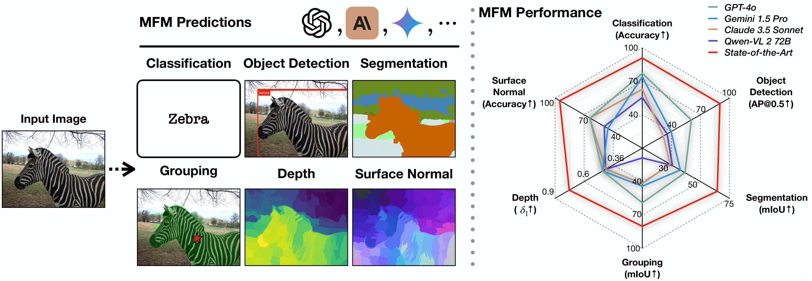

# Solving standard computer vision tasks with multimodal foundation models

*A prompt-chaining framework to unleash the capabilities of multimodal foundation models on several standard computer vision tasks.*

[`Website`](https://4m.epfl.ch) | [`BibTeX`](#citation) 

Official implementation for :

[**How well does GPT-4o understand vision? Solving standard computer vision tasks with multimodal foundation models**](https://fm-vision-evals.epfl.ch/) <br>
*[Rahul Ramachandran](link), [Ali Garjani](https://garjania.github.io/), [Andrei Atanov](https://andrewatanov.github.io/), [Oğuzhan Fatih Kar](https://ofkar.github.io/), [Roman Bachmann](https://roman-bachmann.github.io/), [Amir Zamir](https://vilab.epfl.ch/zamir/)*

<br>



## Abstract

Multimodal foundation models, such as GPT-4o, have recently made remarkable progress. However, it is not clear exactly where these models stand in terms of understanding vision. In this paper, we evaluate the performance of popular multimodal foundation models (GPT-4o, Gemini Pro, Claude 3.5 Sonnet, Qwen2-VL) on standard computer vision tasks (semantic segmentation, object detection, image classification, depth and surface normal prediction) and using established datasets (e.g., COCO, ImageNet and its variants, etc.).

The main challenges to performing this are:
1) The models are trained to output text and cannot natively express versatile domains, such as segments or 3D geometry, and
2) Many leading models are proprietary and accessible only at an API level, i.e., there is no weight access to adapt them.

We address these challenges by translating standard vision tasks into equivalent text-promptable and API-compatible tasks via prompt chaining.

We observe that:
1) The models do not reach state-of-the-art performance in any tasks.
2) They perform semantic tasks notably better than geometric ones.
3) However, they are respectable generalists; this is remarkable as they are presumably trained on primarily image-text-based tasks.
4) While the prompting techniques affect performance, better models exhibit less sensitivity to prompt variations.
5) GPT-4o performs the best, securing the top position in 5 out of 6 tasks.


## Table of contents
- [Usage](#usage)
    - [Installation](#installation)
    - [Getting started](#getting-started)
    - [Documentation](#documentation)
- [License](#license)
- [Citation](#citation)

## Usage

### Installation

1. Clone this repository and navigate to the root directory:
```
git clone https://github.com/EPFL-VILAB/fm-vision-evals
cd fm-vision-evals
```

2. Create a new conda environment, then install the package and its dependencies:
```
conda create -n fm-vision python=3.10 -y
conda activate fm-vision
pip install -r requirements.txt
```

### Getting started

We provide a simple example to generate examples for all tasks using a chosen MFM model. The following code snippet demonstrates how to generate examples for all tasks using the `4o` model:

```python
from taskit.demo import DemoSampler

sampler = DemoSampler(model_name="gpt-4o-2024-08-06", api_key="<your-api-key>")  # Choose from one of gpt-4o-2024-08-06, gemini-1.5-pro, claude-3-5-sonnet-20240620
img_path = './assets/demo_input.jpg'
preds, tokens = sampler(img_path)  # Will roughly take 10 minutes
pred_img = sampler.visualize(preds)
pred_img.save('demo_output.png')

```
You should expect to see an output like the following:


### Documentation

- For a walkthrough of using the API, please refer to the [API documentation](./notebooks/demo.ipynb).
- We provide the documentation for the `taskit` package in [taskit documentation](README_TASKIT.md).

## License

## Citation